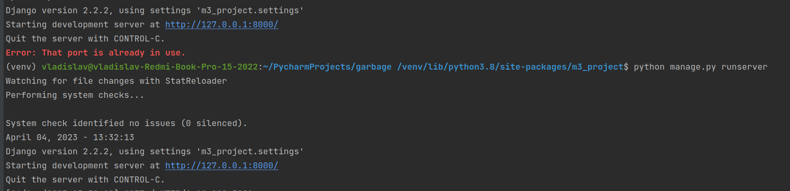

## Тестовое по django для BARS Group 

ссылка на Тестовое 
[Тут](https://docs.google.com/document/d/1eWizXA7_ZXCKYSJf3OnJLqIP3H4jhPAIwEkdtLxo2-w/edit)

### С использованием Poetry
```commandline
poetry install
```
Можно также по старому. 
Для этого был экспорт в requirements.txt `poetry export > requirements.txt`

Пример что работает `setup.py`. Сделанно также с помощью `poetry`

